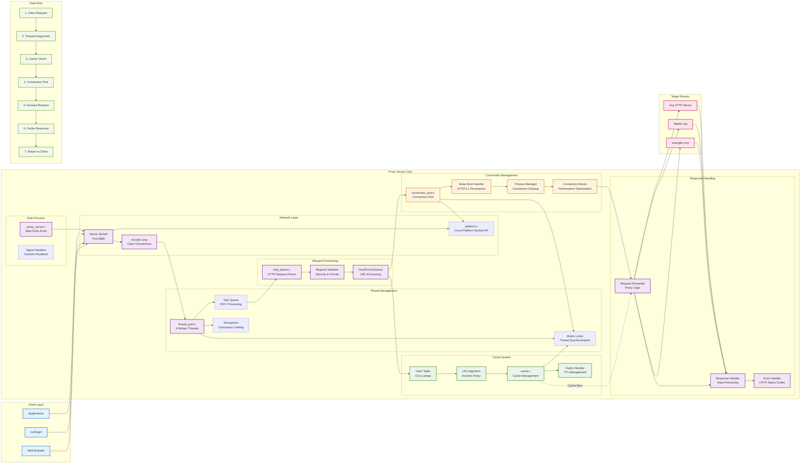
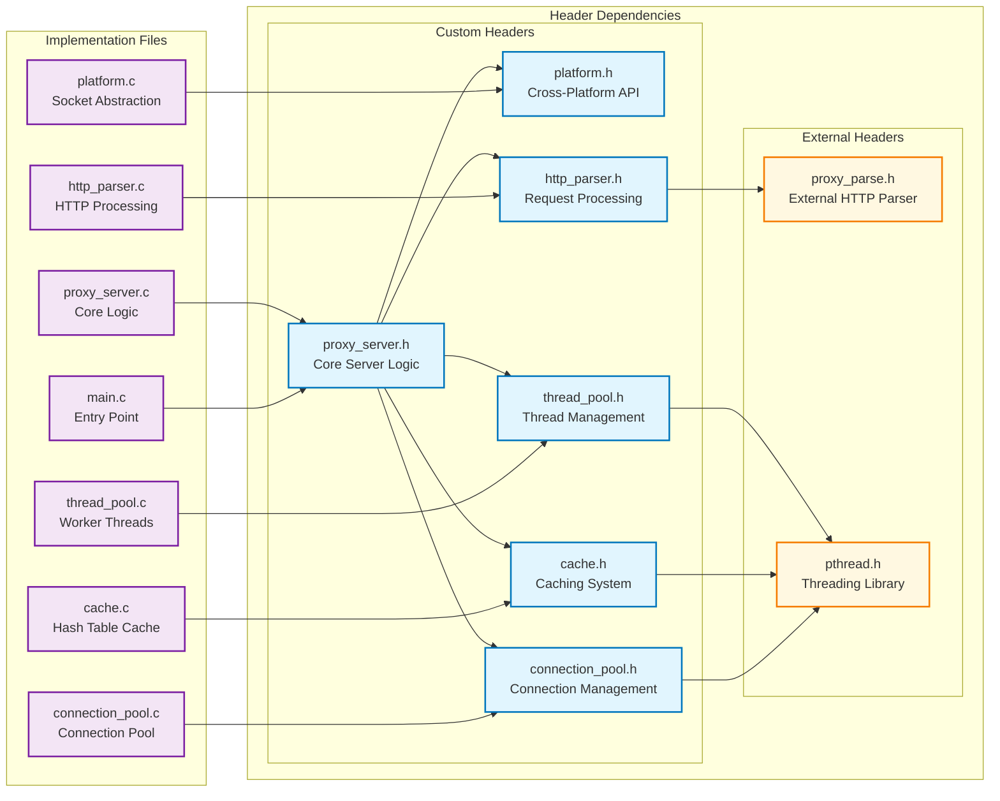

# HTTP Proxy Server - System Architecture

This document contains the comprehensive system architecture diagram using Mermaid.

## System Architecture Diagram

Show/Hide Mermaid Diagram Code

## Component Dependencies

Show/Hide Mermaid Diagram Code

